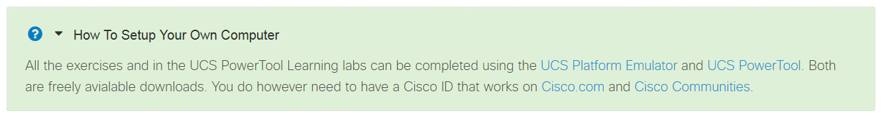

# Step 5: Add Bring Your Own Device (BYOD) information

Author the `byod.html` ("bring your own device") file in HTML, placed in the directory at the same level with the JSON file and contain information about any special setup or requirements for completing the Learning Lab. If your lab requires to have Python installed, if you need to have special hardware or added software, put that information in `byod.html`. The system displays the content as a banner with a link at the top of your lab. Enable this by setting your lab JSON file property `"byod": true`.

Example file `byod.html`:
```
<div>
  <p>All the exercises and in the UCS PowerTool Learning labs can be completed using the <a href="https://community.cisco.com/t5/unified-computing-system/cisco-ucs-platform-emulator-3-1-1epe1/ta-p/3651480" target="_blank">UCS Platform Emulator</a>
  and <a href="https://software.cisco.com/download/release.html?mdfid=286305108&flowid=&softwareid=284574017&release=2.0.1&relind=AVAILABLE&rellifecycle=&reltype=latest" target="_blank">UCS PowerTool</a>.
  Both are freely available downloads.  You do need to have a Cisco ID that works on <a href="http://www.cisco.com" target="_blank">Cisco.com</a>
  and <a href="http://community.cisco.com" target="_blank">Cisco Community</a>.</p>
</div>
```
This file placement results in the following element being displayed at the top of your Learning Lab:


