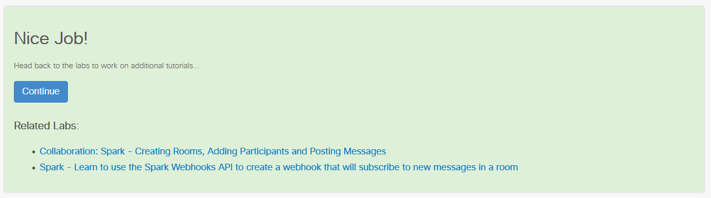

# Step 6: Display related Labs

To display related labs on the completed page, you can reference other labs by adding a JSON array named `related`. You can determine the related lab ID to use by looking at the URL for a given lab. By default, the system expects the lab ID in the path between `labs/` and `step`. Example: `#/labs/cmx/step/1` where cmx is the lab ID.

Example file `collab-spark-auth.json`:
```
{
  "labId": "collab-spark-auth",
  "files": [
    {"title": "1.md"},
    {"title": "2.md"},
    {"title": "3.md"},
    {"title": "4.md"}
  ],
  "related": [
    {
      "labId": "collab-spark-messages",
      "title": "Collaboration: Spark - Creating Rooms, Adding Participants and Posting Messages"
    },
    {
      "labId": "collab-sparkwebhook",
      "title": "Spark - Learn to use the Spark Webhooks API to create a webhook that will subscribe to new messages in a room"
    }
  ]
}
```
This will result in the following element on the completion page of the `collab-spark-auth` lab:


